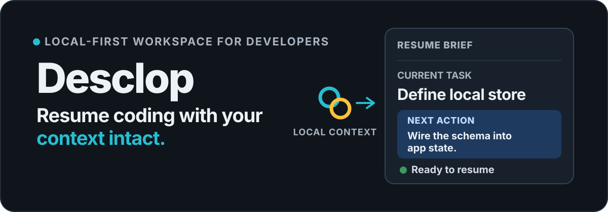
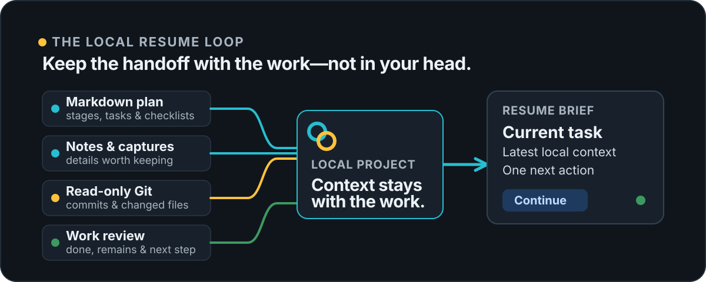

# Desclop

  

  A calm desktop workspace for individual developers: keep one local record of the plan, work context, and next concrete action—then return ready to code.

  <strong>Beta · local-first · desktop-only · read-only Git</strong>

## Return to a project without reconstructing the last session

Desclop keeps the practical context around a local coding project in one place: a plan, task notes, lightweight work history, inbox captures, recent Git activity, and the next action. When you come back, **Today** gives you a Resume Brief so you can continue instead of trying to remember where you stopped.

It is built for solo developers, indie hackers, freelancers, students, pet-project builders, and AI-heavy developers who want their project context to survive between sessions. It is not a team project-management system, a full Git client, or a replacement for Jira.

  

## What Desclop keeps close

- **A usable plan.** Import a Markdown plan into stages, tasks, and checklists; then edit the structure safely in the Planner.
- **The working details.** Keep task notes, manual inbox captures, optional Focus Mode sessions, and work reviews close to the task they belong to.
- **Git context without Git-client scope.** Read-only recent commits and changed-file context can be linked to a task.
- **A concrete way back in.** Resume Brief, Today, Timeline, and Weekly Review surface the current task, what happened, and the next small action.

## The first successful loop

1. Create or open a local project and optionally connect its local Git repository.
2. Import an existing plan from a `.md`, `.markdown`, or `.txt` file.
3. Work normally: update a task, leave a note, capture a thought, or save a work review.
4. Return to **Today** and continue from a specific next action instead of rebuilding the session from scratch.

## Get Desclop

Prebuilt desktop packages are published through [Releases](https://github.com/Clydewtf/desclop/releases). Download the package for your operating system rather than the automatically generated source-code archives.

- macOS: `.dmg` or a macOS app archive
- Linux: `.AppImage`, `.deb` or `.rpm`
- Windows: `.exe` installer

> [!WARNING]
> Desclop is currently in beta (`v0.2.0-beta.2`). Packages are not yet signed or notarized, so macOS and Windows may show platform-security warnings. The Windows installer may need internet access to obtain WebView2.

## Boundaries by design

- Project workflow data stays local to your machine.
- Git integration is read-only.
- Focus Mode is optional; Desclop remains useful without time tracking.
- Markdown exports are readable snapshots, not full-fidelity backups.
- Portable bundles move Desclop workflow data but never copy source code.
- License state stays isolated from project data.

## Status

Desclop is in beta. The current release line focuses on safe local plan import and editing while keeping Today and Resume Brief in sync. Expect rough edges and platform-specific limitations while the beta is validated. See the [changelog](./CHANGELOG.md) for release history.
